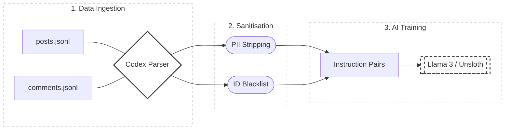

# 🧟 Project Codex: Zombie Waves AI Strategy Engine
> An Advanced RAG (Retrieval-Augmented Generation) & Fine-Tuning Engine for Zombie Waves Game Strategy.

[](https://opensource.org/licences/MIT)
[](https://www.python.org/downloads/)
[](https://ubuntu.com/)
[](https://developer.nvidia.com/cuda-zone)

**Project Codex** is a non-commercial, educational research project designed to build a high-fidelity "Expert AI" for the mobile game Zombie Waves. By leveraging large-scale community datasets from public research archives and executing local fine-tuning on a dedicated NVIDIA-powered workstation, this project explores the intersection of community-driven game theory and Large Language Model (LLM) optimisation.

---

## 🎯 Overview
**ZombieWaves AI-Codex** is an end-to-end data pipeline and AI engine designed to synthesise high-level game meta-strategies. The "Codex" mines thousands of community discussions and expert guides to provide optimised build paths, hero synergies (e.g., MX Hero), and stage-specific tactical advice.

The primary objective is to ingest large volumes of unstructured community data ranging from synergies and hero builds to game exploits—and transform it into a structured, high-signal knowledge base. This refined data serves as the foundation for fine-tuning a specialised LLM, turning "chatter" into actionable strategic intelligence.


## 📊 System Architecture & Data Flow



## 🏗️ Architecture & Tech Stack
This project is built on a high-performance local workstation (ASUS RTX Rig) to ensure data privacy and rapid iteration.

- **Infrastructure:** Ubuntu 24.04 LTS via WSL2.
- **Data Engine:** Custom extraction pipeline using `zstd` and `grep` to process multi-gigabyte Reddit data dumps (Pushshift/Academic Torrents).
- **AI/ML:** - **Framework:** PyTorch with CUDA 12.1 hardware acceleration.
- **Environment:** Miniconda for isolated dependency management.
- **Models:** (Planned) Llama 3 fine-tuned on specialised game datasets.

## 🛠️ Setup & Reproducibility
Maintaining a stable environment for AI development is a primary focus. I have documented the entire bootstrap process, including hardware bridging and complex dependency resolutions (such as Intel MKL symbol conflicts).

👉 **[View the full Environment Setup Log (setup_log.md)](./docs/setup_log.md)**


## 📊 Data Pipeline
The AI is trained on a refined dataset representing the current "Zombie Waves" meta:

1. **Acquisition & Extraction:** Utilising the [Arctic Shift Download Tool](https://arctic-shift.photon-reddit.com/download-tool) to perform targeted, high-integrity exports of the r/ZombieWaves subreddit. This bypasses the need for bulk archive filtering, providing a clean NDJSON dataset of community strategies, hero builds (e.g., MX Hero), and stage-specific guides.

2. **Sanitisation:** A custom Python pipeline that processes the raw NDJSON to enforce privacy standards. This stage programmatically strips PII (usernames/IDs) and cross-references data against a local ID Blacklist to respect the "Right to Erasure."

3. **Refinement:** Transformation of the sanitised text into specialised Instruction-Response pairs formatted specifically for Llama 3 / Unsloth fine-tuning.


## 🚀 Current Status: Data Acquisition
- [x] Hardware/GPU Integration
- [x] Stable Linux Environment Setup
- [x] Python AI Stack Configuration
- [ ] Data Extraction from Dec 2025 Snapshot (In Progress)
- [ ] Fine-Tuning Execution


## 📂 Project Structure

```text
ZombieWaves-AI-Codex/
├── docs/ # Documentation & Logs
├── tests/
│ ├── test_environment.py # Validates WSL/C:/D: connections
│ └── test_sanitizer.py # Validates PII is actually stripped
├── legacy/ # Archived scripts
├── scripts/ # Helper scripts (sanitiser, formatter)
├── data/ # Blacklist.txt (No large .jsonl files here!)
├── .gitignore # Prevents tracking of PII data and secrets
├── main.py <-- THE "BRAIN" (Lives in root)
└── README.md # Documentation & Ethics Statement
```

## ⚖️ Ethics & Compliance

This project is strictly for **personal research and educational purposes**. We prioritise data privacy and respect for the community through the following safeguards:

1. **Sourcing for Research:** Data is sourced from the Academic Torrents archive (Anonymised public dumps). This approach ensures zero impact on Reddit’s live infrastructure and follows established protocols for large-scale data science research.

2. **PII Sanitisation:** The project employs a "Signal over Identity" policy. All Personally Identifiable Information (PII)—including usernames, profile IDs, and specific timestamps—is stripped during the extraction phase. Our training datasets contain only game-mechanic text and strategic discussions.

3. **No Redistribution:** We do not redistribute the raw data dumps. The original archives are stored on a private, local drive and are used solely to generate the refined, anonymous knowledge base for the model.

4. **Right to Erasure Compliance:** While the dataset is a point-in-time snapshot, we prioritise the spirit of "User Deletion Rights." If specific content is identified as retracted or sensitive, it is programmatically purged from our training pipeline.

5. **Non-Commercial:** This project is entirely non-commercial. It is a technical showcase of AI fine-tuning and data engineering, not a product for sale or redistribution.

---

## 📜 Licence

Distributed under the MIT Licence. See LICENSE for more information.

## ⚠️ Disclaimer
**Project Codex** is an independent, non-commercial research project. It is not affiliated with, endorsed by, or officially connected to **Fun Formula**, **Reddit Inc.**, or any of their subsidiaries.

All product names, logos, and brands are property of their respective owners. The use of these names and brands does not imply endorsement. This tool is provided "as-is" for educational purposes, and the author assumes no liability for the accuracy of AI-generated strategies or game outcomes.
